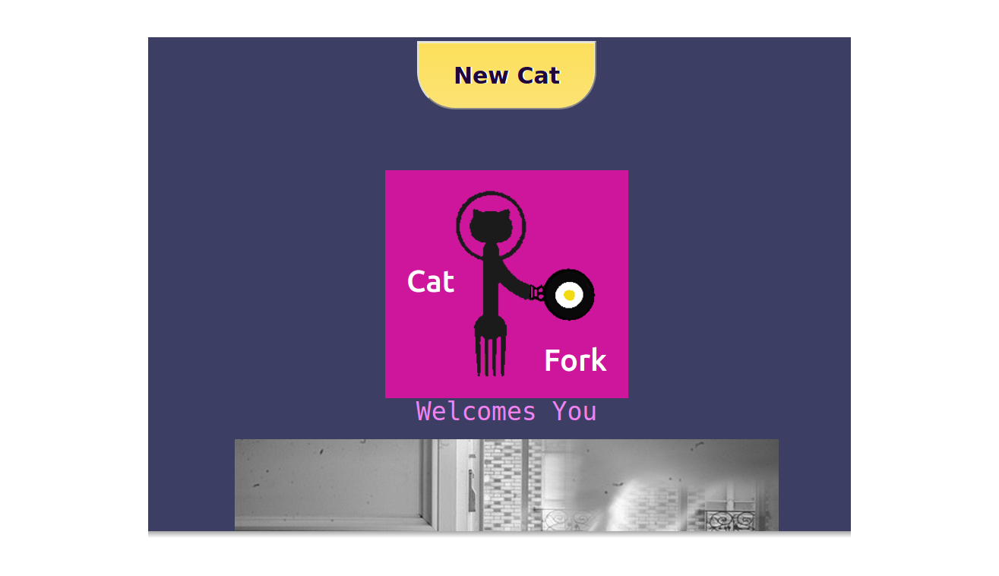

# Stefan Bemelmans Portfolioish
I am a student at the Austin Coding Academy, in the advanced class of the JavaScript Full-Stack Engineering Program, about a month away from graduating. This repo contains what I feel are the highlights of my understanding of the material so far. 
 I am about a month away from graduation as of this writing. 
#CatFork!
This is an app I built at the end of the second semester. I use JS6, Babel and JSX in a React framework to deliver a recipe search experience based on enterable ingredients that relies on 2 API calls. The workhorse is the call to the [Spoonacular](https://spoonacular.api) api, queriing the ingredients and returning the recipes. The second is the cats in CatFork. I discovered the [catApi](https://www.thecatapi.com) and I figured because the internet. [Check It Out](/CatFork.index.html)
The newCat button gets a new random cat. 
So first you start 

My public page,  Please standfa st while I update! Enjoy CatFork!
CatFork is my first app. It's a recipe search based on ingredients. Plus pictures of cats. Any suggestions would be appreciated! 
