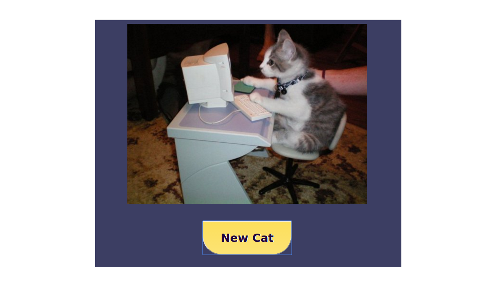

# Stefan Bemelmans Portfolio Repo!
I am a student at the Austin Coding Academy, in the advanced class of the JavaScript Full-Stack Engineering Program, about a month away from graduating. This repo contains what I feel are the highlights of my understanding of the material so far. I am about a month away from graduation as of this writing and it's the middle of August 2017. 

# CatFork!
This is an app I built at the end of the second semester, about 2 months ago. I use JS6, Babel and JSX in a React framework to deliver a recipe search experience based on enterable ingredients. The process relies on 2 API calls. The substance is the call to the [Spoonacular](https://spoonacular.api) api, queriing the ingredients and returning the recipes. The second is the "cat" in CatFork. I discovered the [catApi](https://www.thecatapi.com) and I figured...because the internet. [Check It Out](/CatFork.index.html)
The newCat button gets a new random cat. 
TL;DR;    