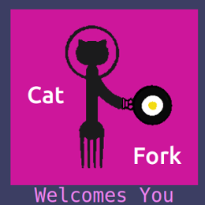

# Stefan Bemelmans Portfolio Repo!
I am a student at the Austin Coding Academy, in the advanced class of the JavaScript Full-Stack Engineering Program, about a month away from graduating. This repo contains what I feel are the highlights of my understanding of the material so far. I am about a month away from graduation as of this writing and it's the middle of August 2017. 

# CatFork!
This is an app I built at the end of the second semester, about 2 months ago. I use JS6, Babel and JSX in the React framework to deliver a recipe search experience based on enterable ingredients. The process relies on 2 API calls. The substance is the call to the [Spoonacular](https://spoonacular.com) api, querying the ingredients and returning the recipes. The second is the "cat" in CatFork. I discovered the [catApi](https://www.thecatapi.com) and I figured...because the internet. [Check It Out](https://stefanbemelmans.github.io/CatFork/index.html)
The newCat button gets a new random cat. 
If you don't have the time, these pictures recreate the experience of searching for "tomato, cheese, herbs", please enjoy:
  __CATS!__
  __CatFork! (I put the logo together using GIMP)__
  __MMMMMM Tomato Cheese and Herbs!__
 __New Cat!__
 
 __OOOh Look at the Recipes!__ I know the PizzaBites look good but it's really just tomato sauce and cheese on a cracker.  
 __That heirloom salad looks great! If I press the button....__
 
__Yay CatFork!__
 
 __New Cat!__ Ideally it's a different cat than the one immediately above.

That's CatFork! An excellent excercise in the handling of API calls and URL variables within the React framework.
Not a bad recipe app either. I'm expanding the functionality for a class project and coming soon will be:
* Login/User Base 
* Favorite Recipe/Cats Folders
* Expanding Search Functionality To Include Nutritional Info, Cusine, Ingredient Substitution
* Ingredient/Recipe Conversion, Including Pan-Size Adjustment For Things In Rimmed Pans! (something I've always wanted)
* Suggest Something!
[here's the link to CatFork again incase now you want to experience it firsthand](https://stefanbemelmans.github.io/CatFork/index.html)
It's cool...
And actually I AM looking for a new job...
Feel free to contact me for any reason.

stefanbemelmans898@gmail.com

#Websites
Coming Soon!
